# 🎙️ Voice Virtual Assistant

A simple voice assistant powered by ElevenLabs Conversational AI. It listens via your microphone, transcribes speech, and responds with synthesized voice.

## 🧩 How it works (visual)

```mermaid
flowchart LR
   U[You 🎤] -->|speak| MIC[Microphone]
   MIC --> E[ElevenLabs Conversational AI]
   E -->|STT| T[Transcript 📝]
   E -->|LLM| R[Response 💬]
   E -->|TTS| S[Audio 🔊]
   S --> SPK[Speakers]
```



## ✅ Setup

1. Create an environment file locally (do not commit secrets):
   - Copy `.env.example` to `test.env`
   - Fill in values for `AGENT_ID` and `API_KEY`

2. Install dependencies:

```bash
pip install -r requirements.txt
```

Alternatively (quick install, not pinned):

```bash
pip install "elevenlabs[pyaudio]" python-dotenv
```

Note: Voice input/output relies on PortAudio.

- Linux:

```bash
sudo apt install portaudio19-dev
```

- macOS:

```bash
brew install portaudio
```

3. (Windows) If PyAudio install fails, try:

```bash
pip install pipwin
pipwin install pyaudio
```

## ▶️ Run

```bash
python -u voice_assistant.py
```

Say “stop”, “exit”, “quit”, “bye”, “goodbye”, or “end session” to end the conversation.

## ⚙️ Configuration

Non-secret text is hardcoded in `voice_assistant.py`:
- `user_name`: default is "Robil"
- `prompt`: default is "You are a helpful assistant."
- `first_message`: default greeting using `user_name`

You can change these lines directly if you want different behavior. Secrets (`AGENT_ID`, `API_KEY`) stay in `test.env`.

## 🔐 Safety & Git Hygiene (if you commit)

- Do not commit `test.env` or any `.env` files. They are excluded by `.gitignore`.
- Logs like `conversation_log.txt` are ignored.
- If a key is accidentally committed, rotate it in the ElevenLabs dashboard immediately.

## 🤖 ElevenLabs Agent Setup

- Create an agent in the ElevenLabs dashboard (Agents → New agent).
- In the agent editor:
   - Set your System prompt and First message as desired.
   - Open Security and enable Overrides for at least: First message and System prompt (so runtime overrides from the app are allowed).
   - Click Publish to apply changes.
- Create an API key (Settings → API Keys) with permissions including ElevenLabs Agents Write (required for Conversational AI). Grant Text to Speech / Speech to Text access if you use audio.
- Copy the Agent ID into `AGENT_ID` and the API key into `API_KEY` in your local `test.env`.
- Ensure your account plan includes access to Conversational AI features.

## 🙏 Credits

This project was inspired by the Codédex tutorial “Create a Voice Virtual Assistant with ElevenLabs” by Alexandre Sajus:

- https://www.codedex.io/projects/create-a-voice-virtual-assistant-with-elevenlabs

I implemented my own version and added small improvements (logging, safer repo setup, and voice-session exit keywords).

## 📄 License

This project is licensed under the MIT License. See `LICENSE` for details.
